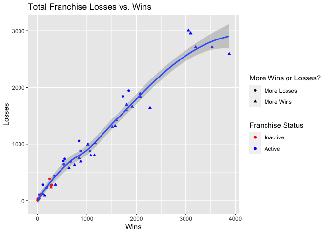
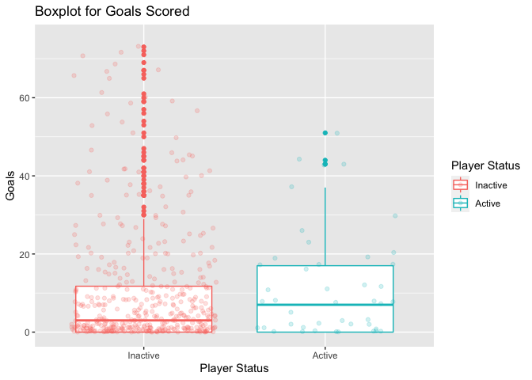
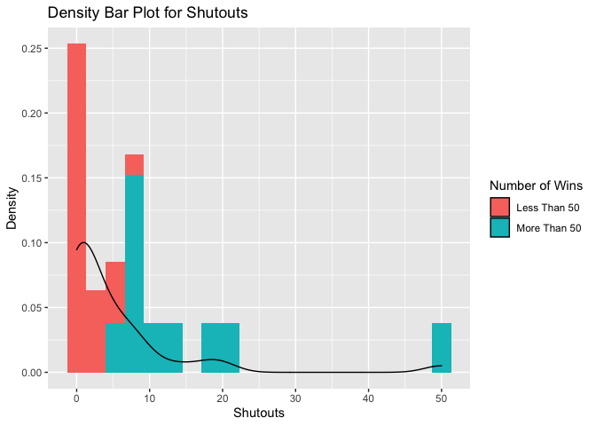
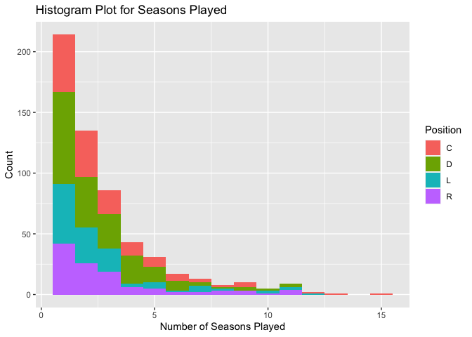
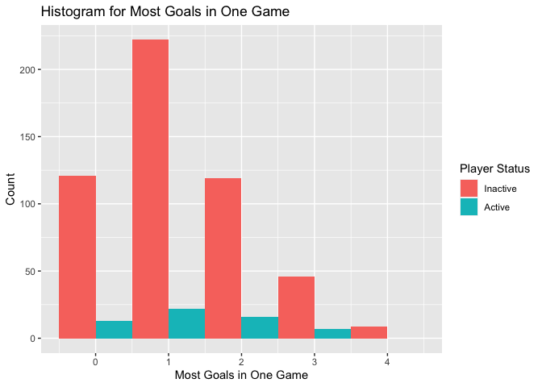
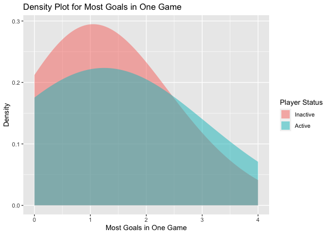

ST558 Project 1
================
Michael Evans
6/12/2020

  - [JSON Data](#json-data)
      - [What is it?](#what-is-it)
      - [Where does it get used?](#where-does-it-get-used)
      - [Why is it a good way to store
        data?](#why-is-it-a-good-way-to-store-data)
      - [Packages Available](#packages-available)
      - [My Choice of Package](#my-choice-of-package)
      - [References](#references)
  - [API Calls](#api-calls)
      - [Franchise Function](#franchise-function)
      - [Franchise Team Totals
        Function](#franchise-team-totals-function)
      - [Season Records for Franchise
        Function](#season-records-for-franchise-function)
      - [Goalie Records for Franchise
        Function](#goalie-records-for-franchise-function)
      - [Skater Records for Franchise
        Function](#skater-records-for-franchise-function)
  - [Exploratory Data Analysis](#exploratory-data-analysis)
      - [Contingency Tables](#contingency-tables)
          - [More Wins/Losses vs. Franchise Status Contingency
            Table](#more-winslosses-vs.-franchise-status-contingency-table)
          - [Seasons Played vs. Position Contingency
            Table](#seasons-played-vs.-position-contingency-table)
      - [Most Goals in a Game vs. Player Status Contingency
        Table](#most-goals-in-a-game-vs.-player-status-contingency-table)
      - [Numerical Summaries](#numerical-summaries)
          - [Summary of Goalie’s Games Played, Losses, Wins, Most Goals
            Against (One Game), and Most Saves (One
            Game)](#summary-of-goalies-games-played-losses-wins-most-goals-against-one-game-and-most-saves-one-game)
      - [Plots](#plots)
          - [Scatter Plot of Losses
            vs. Wins](#scatter-plot-of-losses-vs.-wins)
          - [Box Plot for Goals Scored by Flyers
            Skaters](#box-plot-for-goals-scored-by-flyers-skaters)
          - [Density Histogram for Shutouts by Flyers
            Goalies](#density-histogram-for-shutouts-by-flyers-goalies)
          - [Histogram for Seasons Played by Flyers
            Skaters](#histogram-for-seasons-played-by-flyers-skaters)
          - [Histogram for Most Goals in One Game by Flyers
            Skaters](#histogram-for-most-goals-in-one-game-by-flyers-skaters)
          - [Density Plot for Most Goals in One Game by Flyers
            Skaters](#density-plot-for-most-goals-in-one-game-by-flyers-skaters)
  - [Conclusion](#conclusion)

# JSON Data

In this section of the report, we will discuss JSON data and the
packages in R that can be used to read it.

## What is it?

JSON stands for **Javascript Object Notation** and is a way of storing
data in an organized fashion that is easy to access. Generally regarded
as a **“lightweight data-interchange format”**, JSON data is great for
both humans and machines, as it is both readable by humans and able to
be parsed by machines. It was made popular by Douglas Crawford. This
data type is built on collections of **name/value pairs** and an
**ordered list of values**.

## Where does it get used?

Since the two data types JSON data is built on are generally universal
data structures, JSON data is considered **language-independent**.
Because of this, many of the programming languages used today have ways
of reading JSON data. JSON data is essentially just a text file, which
makes it easy to send over servers. This feature has allowed it to be
used frequently for **transmitting information over the web**.

## Why is it a good way to store data?

Some of the previous features mentioned are the same reasons as to why
JSON data is a good way of storing data. For starters, the “lightweight”
feature of the data makes it **extremely accessible**. JSON data can be
loaded quickly because of how “lightweight” it is, which has made it a
great way to store data on the internet. It can be **called and loaded
quickly**.

Another reason that it is a good way of storing data is because it is
**easily compatible with so many modern programming languages**. This
means that many people working across different programs can still have
easy access to the same datasets.

That being said, there are also some limitations of JSON data. There is
no way to add comments to JSON data. While JSON data is often readable,
it can be **difficult to understand the context of certain things
without comments**. This means that you often need to consult additional
documentation to understand the data. Additionally, the language has no
schema, which means that you could **accidentally create data that you
are not intending to create**. On the other hand, the lack of schema is
something that a lot of people like about JSON data, as it offers more
flexibility.

## Packages Available

There are **three major packages** available in R for reading JSON data.
These include `jsonlite`, `RJSONIO`, and `rjson`. `jsonlite` is the
newest package of the three and was developed based off of the `RJSONIO`
package. While all of these packages are able to read JSON data,
`jsonlite` offers the **ability to return a data frame**. Typically,
`RJSONIO` and `rjson` return a list.

`RJSONIO` was built as an alternative to the `rjson` package to offer a
faster way to convert JSON data in R. Through updates, the `rjson`
package is not just as fast, if not faster, than the `RJSONIO` package.
The `RJSONIO` package also offers some additional options for
customizing the JSON data that is being read into the program.

## My Choice of Package

For this project, I am choosing to use the `jsonlite` package, as I like
that it returns a data frame. The data frame is one of the most usable
objects in R and will be helpful for doing exploratory data analysis
after the data is read in. We will combine this package with the `httr`
package to get JSON data.

To read JSON data, we will first use the `GET()` function from `httr` to
get the whatever information is present from the URL provided. Then, we
will use the `content()` function from `httr` to retrieve the content of
the URL as a text file (use the option `as = "text` to do this).
Finally, we will use the `fromJSON()` function from `jsonlite` to
convert the JSON data to an R object. We will use the `flatten = T`
option to automatically flatten the nested data frame into a non-nested
data frame.

## References

For more information on JSON data and the packages available in R, check
out these resources that were consulted to gather the initial
information: 1. [The JSON Website](https://www.json.org/json-en.html)

2.  [“Working with JSON” by
    Mozilla](https://developer.mozilla.org/en-US/docs/Learn/JavaScript/Objects/JSON)

3.  [“What is JSON? A better format for data exchange” by Jonathan
    Freeman](https://www.infoworld.com/article/3222851/what-is-json-a-better-format-for-data-exchange.html)

4.  [“Better handling of JSON data in R?” by Rolf
    Fredheim](https://www.r-bloggers.com/better-handling-of-json-data-in-r/)

5.  [RJSONIO Package
    Documentation](https://cran.r-project.org/web/packages/RJSONIO/index.html)

6.  [rjson Package
    Documentation](https://cran.r-project.org/web/packages/rjson/index.html)

7.  [jsonlite Package
    Documentation](https://cran.r-project.org/web/packages/jsonlite/index.html)

# API Calls

In this section of the report, we will create functions to contact the
the National Hockey League (NHL) API. Each function will return a data
frame with the appropriate data. We will create 5 functions in total.

## Franchise Function

We will use `function()` to create this function. We will save the URL
that has the data as `full_url`. Then, we will use the `GET()` function
with the full URL and save this object as `get`. Next, we will use the
`content()` function to get the data from this URL. We will want to save
this data as a text file, so we will add the option `as = "text"`. We
will save this output as `content`. Next, we will get the data using the
`fromJSON()` function. We will include the `flatten = T` option to get
this output as a data frame. This object will be saved as `nhl_data`.
Finally, we will select `data` from `nhl_data`, as this has the data we
are looking for. This object will be saved as `data` and returned using
the `return()` function.

``` r
#Franchise Function
franchise <- function(){
  full_url <- "https://records.nhl.com/site/api/franchise"
  get <- GET(url = full_url)
  content <- content(get, as = "text")
  nhl_data <- fromJSON(content, flatten = T)
  data <- nhl_data$data
  return(data)
}
```

We will then get the franchise data by calling the function
`franchise()` and saving the output as the object `franchise_data`.

``` r
#Get Data
franchise_data <- franchise()
```

## Franchise Team Totals Function

We will follow the same steps as we did for the `franchise()` function,
except we will change the URL to access data about franchise team
totals.

``` r
#Franchise Team Totals Function
team_totals <- function(){
  full_url <- "https://records.nhl.com/site/api/franchise-team-totals"
  get <- GET(url = full_url)
  content <- content(get, as = "text")
  nhl_data <- fromJSON(content, flatten = T)
  data <- nhl_data$data
  return(data)
}
```

We will then get the total stats for each franchise by calling the
function `team_totals()` and saving the output as the object
`team_totals_data`.

``` r
#Get Data
team_totals_data <- team_totals()
```

## Season Records for Franchise Function

We will follow the same steps as we did for the `franchise()` function,
except this function will take in an ID and return the appropriate data
set for that ID. Within the function, we will use `paste0()` to combine
the base URL with the given ID. The base URL will access data on season
records for different franchises.

``` r
#Season Records for Franchise
season_franchise <- function(ID){
  ID <- as.character(ID)
  full_url <- paste0("https://records.nhl.com/site/api/franchise-season-records?cayenneExp=franchiseId=", ID) 
  get <- GET(url = full_url)
  content <- content(get, as = "text")
  nhl_data <- fromJSON(content, flatten = T)
  data <- nhl_data$data
  return(data)
}
```

We will then get the season records for a specific franchise by calling
the function `season_franchise("ID")` and saving the output as the
object `season_franchise_data`. For this analysis, we will get data for
the Philadelphia Flyers, so we will use `"16"` as the ID.

``` r
#Get Data
season_franchise_data <- season_franchise("16")
```

    ## No encoding supplied: defaulting to UTF-8.

## Goalie Records for Franchise Function

We will follow the same steps as we did for the `franchise()` function,
except this function will take in an ID and return the appropriate data
set for that ID. Within the function, we will use `paste0()` to combine
the base URL with the given ID. The base URL will access data on goalie
records for different franchises.

``` r
#Goalie Records for Franchise
goalie_records <- function(ID){
  ID <- as.character(ID)
  full_url <- paste0("https://records.nhl.com/site/api/franchise-goalie-records?cayenneExp=franchiseId=", ID) 
  get <- GET(url = full_url)
  content <- content(get, as = "text")
  nhl_data <- fromJSON(content, flatten = T)
  data <- nhl_data$data
  return(data)
}
```

We will then get the goalie records for a specific franchise by calling
the function `goalie_records("ID")` and saving the output as the object
`goalie_records_data`. For this analysis, we will get data for the
Philadelphia Flyers, so we will use `"16"` as the ID.

``` r
#Get Data
goalie_records_data <- goalie_records("16")
```

## Skater Records for Franchise Function

We will follow the same steps as we did for the `franchise()` function,
except this function will take in an ID and return the appropriate data
set for that ID. Within the function, we will use `paste0()` to combine
the base URL with the given ID. The base URL will access data on skater
records for different franchises.

``` r
#Skater Records for Franchise
skater_records <- function(ID){
  ID <- as.character(ID)
  full_url <- paste0("https://records.nhl.com/site/api/franchise-skater-records?cayenneExp=franchiseId=", ID) 
  get <- GET(url = full_url)
  content <- content(get, as = "text")
  nhl_data <- fromJSON(content, flatten = T)
  data <- nhl_data$data
  return(data)
}
```

We will then get the skater records for a specific franchise by calling
the function `skater_records("ID")` and saving the output as the object
`skater_records_data`. For this analysis, we will get data for the
Philadelphia Flyers, so we will use `"16"` as the ID.

``` r
#Get Data
skater_records_data <- skater_records("16")
```

# Exploratory Data Analysis

In this section of the report, we will explore some the data sets we
acquired. We will look at contingency tables to see counts of different
variables, numerical summaries to see the distributions of our data, and
graphics to further explore trends.

## Contingency Tables

### More Wins/Losses vs. Franchise Status Contingency Table

In our first contingency table, we will look at the count of a newly
created variable and the status of a franchise (active/inactive) for the
`team_totals_data`. To start, we will make the `activeFranchise`
variable a factor.

``` r
#Make frachise status a factor
team_totals_data$activeFranchise <- as.factor(team_totals_data$activeFranchise)
```

Next, we will work on creating a new variable, `win_greater_loss` that
tells whether a franchise has more wins or more losses throughout their
history. To do this, we will start by summing the wins and losses for
each time, since they are split between two rows in our initial data
set. We will use the `aggregate()` function combined with `sum` in order
to do this.

``` r
#Sum the number of wins and losses per each unique team
team_totals <- aggregate(list(team_totals_data$wins, team_totals_data$losses), by = list(team_totals_data$teamId, team_totals_data$activeFranchise, team_totals_data$teamName), sum)
```

Once this is done, we will rename the columns of this data frame so that
they match the initial column names.

``` r
#Rename the columns
names(team_totals) <- c("teamId", "activeFranchise", "teamName", "wins", "losses")
```

We will then use the `mutate()` function to create our variable,
`win_greater_loss` that assigns either `"More Wins"` or `"More Losses`
based on whether a franchises wins exceeds its losses. We will use the
`iflese()` function to make this comparison.

``` r
#Add variable to indictate is wins > losses
team_totals <- team_totals %>% mutate(win_greater_loss = ifelse(wins > losses, "More Wins", "More Losses"))
```

Next, we will make our newly created variable a factor by using the
`as.factor()` function.

``` r
#Make variable a factor
team_totals$win_greater_loss <- as.factor(team_totals$win_greater_loss)
```

We are now ready to create our contingency table. We will use the
`table()` function to get our initial table and save this output as
`table.1`. We’ll rename the columns and rows to convey the needed
information using `colnames()` and `rownames()`. Once renamed, we will
display the contingency table using `kable()` with the added caption.

``` r
#Create Contingency Table
table.1 <- table(team_totals$activeFranchise, team_totals$win_greater_loss)

#Rename Columns
colnames(table.1) <- c("More Losses", "More Wins")

#Rename Rows
rownames(table.1) <- c("Inactive", "Active")

#Create Kable
kable(table.1, caption = "More Wins/Losses vs. Franchise Status")
```

|          | More Losses | More Wins |
| -------- | ----------: | --------: |
| Inactive |          11 |         2 |
| Active   |          17 |        27 |

More Wins/Losses vs. Franchise Status

**Analysis:**

An initial inspection of this contingency table shows that inactive
franchises have a higher amount of franchises with more losses than wins
(11 of 13) than active franchises (17 of 34). This could suggest that
inactive franchises become inactive because they struggle. These
struggles could lead to a lack of fan support, which means less revenue,
and thus, an inability to stay active.

### Seasons Played vs. Position Contingency Table

In our second contingency table, we will look at the count of positions
and the number of seasons a player plays for the `skater_records_data`.
We will just be using data on the Philadelphia Flyers skaters.

We will use the `table()` function to get our initial table and save
this output as `table.2`. Then, we will display the contingency table
using `kable()` with the added caption.

``` r
#Create Contingency Table
table.2 <- table(skater_records_data$positionCode, skater_records_data$seasons)

#Create Kable
kable(table.2, caption = "Seasons Played vs. Position")
```

|   |  1 |  2 |  3 |  4 |  5 | 6 | 7 | 8 | 9 | 10 | 11 | 12 | 13 | 15 |
| - | -: | -: | -: | -: | -: | -: | -: | -: | -: | -: | -: | -: | -: | -: |
| C | 47 | 38 | 20 | 11 |  8 | 6 | 3 | 2 | 4 |  0 |  0 |  1 |  1 |  1 |
| D | 76 | 42 | 28 | 23 | 13 | 8 | 3 | 1 | 3 |  2 |  3 |  0 |  0 |  0 |
| L | 49 | 29 | 19 |  3 |  5 | 1 | 5 | 2 | 0 |  2 |  2 |  1 |  0 |  0 |
| R | 42 | 26 | 19 |  6 |  5 | 2 | 2 | 3 | 3 |  1 |  4 |  0 |  0 |  0 |

Seasons Played vs. Position

**Analysis:**

An initial inspection of this contingency table suggests that each
position follows a similar distribution for the number of seasons
played. Most players play somewhere between 1 to 6 seasons, while much
fewer play more than 6. Only a handful at each position have played more
than 10.

## Most Goals in a Game vs. Player Status Contingency Table

In our third contingency table, we will look at the count of most goals
in a game and the player status (active/inactive) `skater_records_data`.
We will just be using data on the Philadelphia Flyers skaters.

We will use the `table()` function to get our initial table and save
this output as `table.3`. We will rename the rows using `rownames()` in
order to convey whether a player is active or inactive. Then, we will
display the contingency table using `kable()` with the added caption.

``` r
#Create Contingency Table
table.3 <- table(skater_records_data$activePlayer, skater_records_data$mostGoalsOneGame)

#Rename Rows
rownames(table.3) <- c("Inactive", "Active")

#Create Kable
kable(table.3, caption = "Most Goals in a Game vs. Player Status")
```

|          |   0 |   1 |   2 |  3 | 4 |
| -------- | --: | --: | --: | -: | -: |
| Inactive | 121 | 222 | 119 | 46 | 9 |
| Active   |  13 |  22 |  16 |  7 | 0 |

Most Goals in a Game vs. Player Status

**Analysis:**

An initial inspection of this contingency table suggests that the most
goals scored in one game is distributed similarly for both active and
inactive players. The trend follows a similar pattern for both, which is
an initial amount of players with 0, which we will reference as x. Then,
\~2x players have 1, \~x players have 2, and \~.5x players have 3. One
significant difference in this data is that no active players have 4
goals. However, when you consider this number for inactive players is
\~.1x, this makes sense, as 10% of the initial number of active players
would be \~1.

## Numerical Summaries

### Summary of Goalie’s Games Played, Losses, Wins, Most Goals Against (One Game), and Most Saves (One Game)

To create this summary, we will start with the `goalie_records_data` and
use the `select()` function to get the columns we want a summary of. We
will save this as `goalie_records_summary` to preserve the initial data.

``` r
goalie_records_summary <- goalie_records_data %>% select(gamesPlayed, losses, wins, mostGoalsAgainstOneGame,
                                                         mostSavesOneGame)
```

Next, we will use `sapply()` to find the statistics we want for each
column. The `sapply()` function applies a function over all rows of a
data frame. We will need to do this for each statistic wanted. Save each
output as its own object, using table.4 through table.9.

``` r
#Get min, 25th quantile, mean, median, 75th quantile, and max
table.4 <- sapply(goalie_records_summary, min)
table.5 <- sapply(goalie_records_summary, quantile, probs = .25)
table.6 <- sapply(goalie_records_summary, mean)
table.7 <- sapply(goalie_records_summary, median)
table.8 <- sapply(goalie_records_summary, quantile, probs = .75)
table.9 <- sapply(goalie_records_summary, max)
```

We will then use the `rbind()` function to combine each individual table
into one table. We will save this as `table.10`. Then, we will use the
`round()` function to display all numerical output without any decimals.

``` r
#Combine into one table
table.10 <- rbind(table.4, table.5, table.6, table.7, table.8, table.9)
table.10 <- round(table.10, digits = 0)
```

Next, we will rename the rows with `rownames()` to show the statistic
each row contains. Next, we will rename the columns with `colnames()` to
show the hockey statistic each column contains.

``` r
#Rename rows
rownames(table.10) <- c("Min.", "25th Percentile", "Mean", "Median", "75th Percentile", "Max.")

#Rename Columns
colnames(table.10) <- c("Games Played", "Losses", "Wins", "Most Goals Against (One Game)", 
                         "Most Saves (One Game)") 
```

Finally, we will display the summary table using `kable()` with the
added caption.

``` r
#Create Kable
kable(table.10, caption = "Summary for Goalie Statistics")
```

|                 | Games Played | Losses | Wins | Most Goals Against (One Game) | Most Saves (One Game) |
| --------------- | -----------: | -----: | ---: | ----------------------------: | --------------------: |
| Min.            |            1 |      0 |    0 |                             2 |                    20 |
| 25th Percentile |           12 |      3 |    4 |                             5 |                    34 |
| Mean            |           89 |     29 |   41 |                             6 |                    39 |
| Median          |           48 |     15 |   22 |                             6 |                    40 |
| 75th Percentile |          111 |     35 |   52 |                             7 |                    45 |
| Max.            |          489 |    172 |  240 |                            11 |                    54 |

Summary for Goalie Statistics

**Analysis:**

The summary table above doesn’t show us anything that we didn’t expect
to see. Rather, it gives us an idea of the distribution of each hockey
statistic. For someone unfamiliar with hockey, this could help put into
perspective how players fare. For example, knowing that the average
Flyers goalie has a mean games played of NA suggests that the average
Flyers goalie does not have a very long career, as the average NHL
season has 82 games.

## Plots

For all of the visuals created below, the 1`ggplot2` package will be
utilized. The code used to produce each graph is shown prior to the
analysis below each graph.

### Scatter Plot of Losses vs. Wins

``` r
#First Visual
visuals.1 <- ggplot(data = team_totals, aes(x = wins, y = losses))
visuals.1 + geom_point(aes(color = activeFranchise, shape = win_greater_loss)) +
  geom_smooth() + 
  labs(color = "Franchise Status", shape = "More Wins or Losses?", title = "Total Franchise Losses vs. Wins",
       x = "Wins", y = "Losses") + 
  scale_color_manual(values = c("red", "blue"), labels = c("Inactive", "Active"))
```

    ## `geom_smooth()` using method = 'loess' and formula 'y ~ x'

<!-- -->

**Analysis:**

This plot suggests that the teams in the league with the most wins not
only have the most wins, but also have more wins than losses. This
suggests that the teams that win the most do so consistently. At the
bottom of the graph, there are a lot of teams marked inactive. This
suggests that the inactive teams were not around for long before they
became inactive. The regression line in the plot also confirms the
original observation. Its flattening out at the top shows that those
teams have more wins than losses.

### Box Plot for Goals Scored by Flyers Skaters

``` r
#Second Visual
visuals.2 <- ggplot(data = skater_records_data, aes(x = activePlayer, y = goals))
visuals.2 + geom_boxplot(aes(color = activePlayer)) +
  geom_jitter(aes(color = activePlayer), alpha = .2) +
  ylim(0, 75) +
  labs(title = "Box Plot for Goals Scored", color = "Player Status", x = "Player Status", y = "Goals") +
  scale_x_discrete(labels = c("Inactive", "Active")) +
  scale_color_discrete(labels = c("Inactive", "Active"))
```

<!-- -->

**Analysis:**

This box plot shows that on average, active players are scoring more
goals than inactive players. The plot also shows that there are
significantly more inactive players than there are active players.
Because of that, it’s likely that over time, active players and their
goals scored will regress to be closer to the inactive amount. It could
be that at the moment the Flyers have a lot of players on their roster
with a lot of career goals, which is driving up the average since the
population size is smaller.

### Density Histogram for Shutouts by Flyers Goalies

``` r
#Add variable to indictate if wins > 50
goalie_records_data <- goalie_records_data %>% mutate(win_50 = ifelse(wins > 50, "More Than 50", "Less Than 50"))

#Make variable a factor
goalie_records_data$win_50 <- as.factor(goalie_records_data$win_50)

visuals.3 <- ggplot(data = goalie_records_data, aes(x = shutouts))
visuals.3 + geom_histogram(aes(fill = win_50, y = ..density..), bins = 20) +
  geom_density() +
  labs(title = "Density Bar Plot for Shutouts", x = "Shutouts", y = "Density", fill = "Number of Wins")
```

<!-- -->

**Analysis:**

In this density plot, we can see the distribution of shutouts, which is
highly concentrated at lower amounts of shutouts. This makes sense, as a
shutout is a skilled accomplishment in hockey. Another interesting
observation is that almost all of the goals with more than 5 shutouts
have more than 50 career wins. This shows that goalies that are highly
skilled, and thus, win more games, generally also have more shutouts.
This could also occur because goalies that win more games stay around
for longer duration, which provides more opportunities to get shutouts.

### Histogram for Seasons Played by Flyers Skaters

``` r
visuals.4 <- ggplot(data = skater_records_data, aes(x = seasons))
visuals.4 + geom_histogram(aes(fill = positionCode), bins = 15) +
  labs(title = "Histogram Plot for Seasons Played", x = "Number of Seasons Played", y = "Count", fill = "Position")
```

<!-- -->

**Analysis:**

In this histogram, we look at the number of seasons played broken down
by position. This is the visual representation of the contingency table
we looked at earlier in the analysis. This graph confirms the
observation from that table, being that it appears the number of seasons
played follow a similar distribution at all positions.

### Histogram for Most Goals in One Game by Flyers Skaters

``` r
visuals.5 <- ggplot(data = skater_records_data, aes(x = mostGoalsOneGame))
visuals.5 + geom_histogram(aes(fill = activePlayer), bins = 5, position = "dodge") +
  labs(title = "Histogram for Most Goals in One Game", x = "Most Goals in One Game", y = "Count", 
       fill = "Player Status") +
  scale_fill_discrete(labels = c("Inactive", "Active"))
```

<!-- -->

**Analysis:**

In this histogram, we look at the most goals in one game by Flyers
skaters and the count of each occurrence. While it is clear that the
inactive players have higher counts, it seems like the both inactive and
active players follow similar densities. In the next graph, we will see
if this is indeed the game.

### Density Plot for Most Goals in One Game by Flyers Skaters

``` r
visuals.6 <- ggplot(data = skater_records_data, aes(x = mostGoalsOneGame))
visuals.6 + geom_density(aes(fill = activePlayer), color = NA, size = 3, adjust = 5, alpha = .5) +
  labs(title = "Density Plot for Most Goals in One Game", x = "Most Goals in One Game", y = "Density", 
       fill = "Player Status") +
  scale_fill_discrete(labels = c("Inactive", "Active"))+
  guides(color = FALSE)
```

<!-- -->

**Analysis:**

This is the density plot of the histogram shown in the plot above. This
confirms the initial observation, which is that both inactive and active
players follow a similar distribution for most goals in one game. While
inactive players are a little higher for one goal and two goals, the
density curves are relatively similar.

# Conclusion

In this analysis, we’ve explored JSON data through the NHL API. We’ve
written functions to access this data and get data for a specific team.
We’ve then explored that data through contingency tables, numerical
summaries, and visualizations. While no significant conclusions have
been drawn about the data, this process has explored a number of basic
exploratory data analysis functions that could be applied to higher
level analysis in the future.
