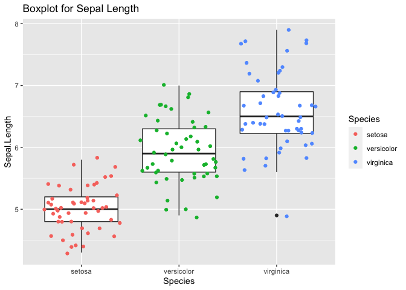
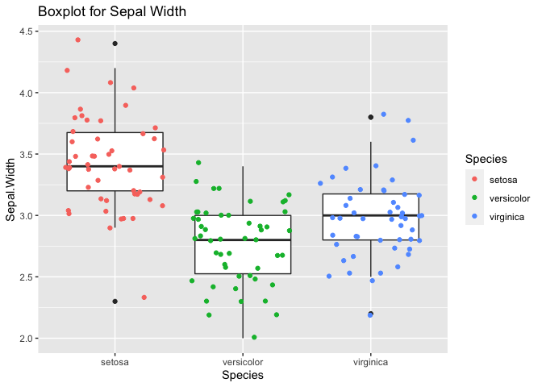
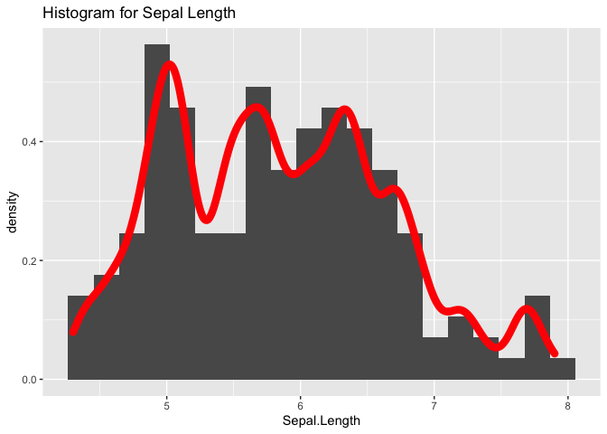
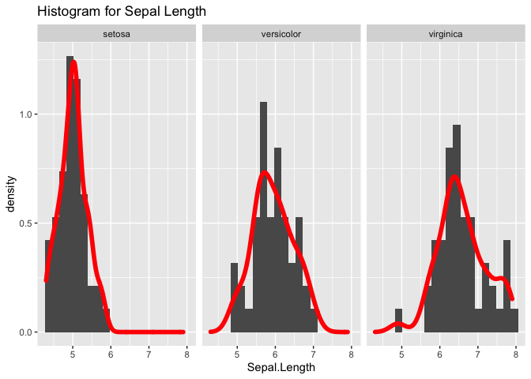
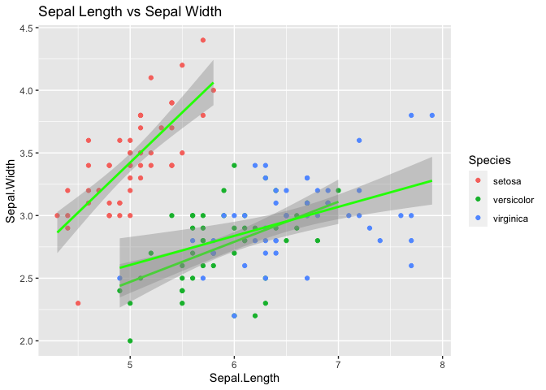
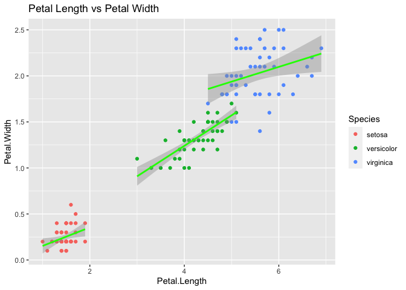

ST558 Homework 1
================
Michael Evans
6/5/2020

# Iris Data Set

## Introduction

The **Iris flower data set** or **Fisher’s Iris data set** is a
multivariate data set introduced by the British statistician and
biologist Ronald Fisher in his 1936 paper *The use of multiple
measurements in taxonomic problems* as an example of [linear
discriminant
analysis](https://en.wikipedia.org/wiki/Linear_discriminant_analysis).

| Sepal.Length | Sepal.Width | Petal.Length | Petal.Width | Species |
| -----------: | ----------: | -----------: | ----------: | :------ |
|          5.1 |         3.5 |          1.4 |         0.2 | setosa  |
|          4.9 |         3.0 |          1.4 |         0.2 | setosa  |
|          4.7 |         3.2 |          1.3 |         0.2 | setosa  |
|          4.6 |         3.1 |          1.5 |         0.2 | setosa  |
|          5.0 |         3.6 |          1.4 |         0.2 | setosa  |
|          5.4 |         3.9 |          1.7 |         0.4 | setosa  |

Preview of Iris Data

## Numeric Summaries by Species

Words about what they look at below.

|         | Sepal.Length | Sepal.Width | Petal.Length | Petal.Width |
| ------- | -----------: | ----------: | -----------: | ----------: |
| Min.    |          4.3 |         2.3 |          1.0 |         0.1 |
| 1st Qu. |          4.8 |         3.2 |          1.4 |         0.2 |
| Median  |          5.0 |         3.4 |          1.5 |         0.2 |
| Mean    |          5.0 |         3.4 |          1.5 |         0.2 |
| 3rd Qu. |          5.2 |         3.7 |          1.6 |         0.3 |
| Max     |          5.8 |         4.4 |          1.9 |         0.6 |

Summary of Species setosa

|         | Sepal.Length | Sepal.Width | Petal.Length | Petal.Width |
| ------- | -----------: | ----------: | -----------: | ----------: |
| Min.    |          4.9 |         2.0 |          3.0 |         1.0 |
| 1st Qu. |          5.6 |         2.5 |          4.0 |         1.2 |
| Median  |          5.9 |         2.8 |          4.3 |         1.3 |
| Mean    |          5.9 |         2.8 |          4.3 |         1.3 |
| 3rd Qu. |          6.3 |         3.0 |          4.6 |         1.5 |
| Max     |          7.0 |         3.4 |          5.1 |         1.8 |

Summary of Species versicolor

|         | Sepal.Length | Sepal.Width | Petal.Length | Petal.Width |
| ------- | -----------: | ----------: | -----------: | ----------: |
| Min.    |          4.9 |         2.2 |          4.5 |         1.4 |
| 1st Qu. |          6.2 |         2.8 |          5.1 |         1.8 |
| Median  |          6.5 |         3.0 |          5.5 |         2.0 |
| Mean    |          6.6 |         3.0 |          5.6 |         2.0 |
| 3rd Qu. |          6.9 |         3.2 |          5.9 |         2.3 |
| Max     |          7.9 |         3.8 |          6.9 |         2.5 |

Summary of Species virginica

## Visuals

### Boxplot for Comparison

Words about what they look at
below.

<!-- --><!-- -->

### Multiple Distributions Present

Words about what they look at
below.

<!-- --><!-- -->

### Scatterplot

Words about what they look at
below.

<!-- --><!-- -->
